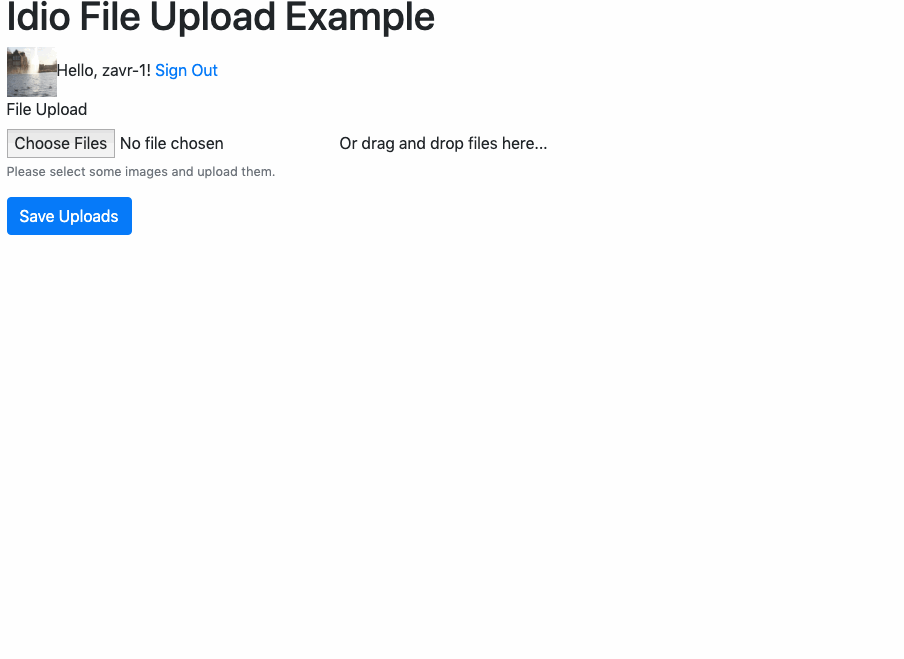

# file-upload.artdeco.app

This app is the back-end for the [File Upload](https://file-upload.artdeco.app) website. It includes the server-side code for handling of file uploads in Node.JS within the _Idio_ web server. It also has front-end code for _Preact_ components for the JavaScript photo upload widget. The frond-end is built using _Closure Compiler_ run on JSX transpiled with `@a-la/jsx` package.

<a href="#README"></a>

<p align="center"><a href="#table-of-contents">
  
</a></p>

## On This Page

<a name="table-of-contents"></a>

- [On This Page](#on-this-page)
- [The Server](#the-server)
  * [1. cors](#1-cors)
  * [2. compression](#2-compression)
  * [3. form](#3-form)
  * [4. frontend](#4-frontend)
  * [5. static](#5-static)
  * [6. session](#6-session)
- [Router](#router)
  * [watch routes](#watch-routes)
- [Front End](#front-end)
  * [building](#building)
  * [development](#development)

<p align="center"><a href="#table-of-contents">
  
</a></p>


## The Server

The server is implemented using the `@idio/idio` package with the route initialisation by `@idio/router` for fast reloading of pages when on the development environment. The _GitHub_ authorisation for session demo is enabled with `@idio/github` which sets up the appropriate routes to perform 3-way handshake with _GitHub_ by obtaining a temporary token and then exchanging it for the access token, with which such information as the user name is obtained.

```jsx
const { app, url, middleware, router } = await idio({
  cors: {
    use: true,
    origin: PROD && [FRONT_END, HOST],
    credentials: true,
  },
  compress: { use: true },
  form: {
    dest: 'upload',
  },
  frontend: { use: !PROD },
  static: [{ use: CLOSURE, root: 'docs' }, {
    use: true,
    root: 'upload',
  }],
  session: { keys: [SESSION_KEY] },
  forms: {
    middlewareConstructor() {
      return async (ctx, next) => {
        const f = middleware.form.any()
        await f(ctx, next)
      }
    },
  },
  csrf: { middlewareConstructor() {
    return async (ctx, next) => {
      const { session } = ctx
      if (!session) throw new Error('!Session does not exist.')
      const { csrf } = session
      if (!csrf) {
        ctx.body = { error: '!Not signed in' }
        ctx.status = 400
        return
      }
      const { csrf: c1 } = ctx.request.body
      const { csrf: c2 } = ctx.query
      const c = c1 || c2
      if (csrf != c) {
        ctx.body = { error: '!Invalid csrf token.' }
        ctx.status = 401
        return
      }
      await next()
    }
  } },
  async jsonErrors(ctx, next) {
    try {
      await next()
    } catch (err) {
      if (err.message.startsWith('!')) {
        ctx.body = { error: err.message.replace('!', '') }
        console.log(err.message)
      } else {
        ctx.body = { error: 'internal server error' }
        err.stack = cleanStack(err.stack)
        app.emit('error', err)
      }
    }
  },
}, { port })
```

The server is used in such a way as to enable all _Idio_ middleware. Additional custom middleware is added as functions to the config (`forms` to just parse form-data without file upload, `csrf` for validation of CSRF tokens either from the query or form-data, and `jsonErrors` to catch any errors and send them as JSON).

### 1. cors

Cors is needed since images are uploaded using Ajax requests, therefore to send data to the server, the browser needs to make sure that the domain security is in tact (no sending data from 3rd party domains).

### 2. compression

Compression for images is not useful, therefore the standard compressible filter utilises the `mime-db` information to find out if the response should be compressed:

```json
{
  "image/svg+xml": {
    "source": "iana",
    "compressible": true,
    "extensions": ["svg","svgz"]
  },
  "image/png": {
    "source": "iana",
    "compressible": false,
    "extensions": ["png"]
  },
  "and so": "on"
}
```

Uploaded files are saved on the disk for serving later on, and if the image can be compressed (e.g., an SVG), the compression middleware will make sure that the response stream is run through GZIP.

### 3. form

Images are sent using `multipart/form-data` HTTP protocol that uses boundaries to split fields and files. By specifying the destination into which to upload files, this middleware will make `ctx.file` accessible to the context if files were uploaded. If no destination was provided, files would be saved in memory, which is not ideal since due to many parallel requests that can exhaust memory of the server.

### 4. frontend

The frontend middleware is used for development purposes to render JSX and serve components from `node_modules`, such as the _PhotoUploader_ component published as a separate package. The frontend bundle is compiled for production use, therefore this middleware is used only for development.

### 5. static

The `static` configuration contains 2 records for 2 purposes:
1. The compiled frontend bundle will be placed into the `docs` folder, so we use the static middleware to test it locally. On production, the `ctx.STATIC_HOST` variable will point to the actual host (github pages).
1. Photos are uploaded into the `upload` folder, and the static middleware will allow to serve them to clients.

### 6. session

File upload is only allowed to signed-in users. The authentication is performed with _GitHub_, which stores `github_user` info in session alongside a _CSRF_ token generated once for each user. The authentication information is made available via the `/auth` [route](routes/get/auth.js) which is accessed once the app is mounted. The middleware chain for file upload will first check if the user is present in the session, then that the declared _CSRF_ token is correct, and finally execute the server logic.

<p align="center"><a href="#table-of-contents">
  
</a></p>


## Router

The router in this app is returned from the `idio` method, and can be used to assign routes. There are 2 routes used in the upload process: a) the actual file data handler, that saves file on the disk, and returns its ID together with the link to image, and b) the form-data handler with IDs of saved files. This is because files will first be put in the "upload sink", and only after that saved in the database using the `/save` route using their IDs. Such strategy would, for example, allow to substitute the sink route for another service, such as a serverless function, but save IDs using traditional method.

```js
router.post('/upload',
  // 1. parse session
  middleware.session,
  // 2. validate session
  (ctx, next) => {
    if (!ctx.session.github_user) throw new Error('!Authorisation required.')
    return next()
  },
  // 3. extract csrf from the query and match against session
  middleware.csrf,
  // 4. receive an upload with "image" file field
  (ctx, next) => middleware.form.single('image')(ctx, next),
  // 5. handle uploaded file
  async (ctx) => {
    const { ext } = parse(ctx.file.originalname)
    ctx.body = {
      photoId: sync(18),
      success: 1,
      result: `/upload/${ctx.file.filename}${ext}`,
    }
  }
)
router.post('/save',
  (ctx, next) => middleware.form.none()(ctx, next),
  (ctx) => {
    ctx.body = { data: ctx.request.body.photos }
  }
)
```

### watch routes

Additionally, the router has an extension called `@idio/router` that will read the `routes` directory, and install routes for HTTP methods from there (e.g., `get` and `post` methods in this app). This is an alternative to source-code based definition of routes. Routes from files can also define the middleware from the `middleware` object returned by _Idio_ using names of configured extensions, as shown below.

```js
/**
 * @type {import('../../').Middleware}
 */
export default (ctx) => {
  ctx.session = null
  ctx.body = { ok: 1 }
}

export const middleware = (route) =>
  ['session', 'forms', 'csrf', route]
```

<p align="center"><a href="#table-of-contents">
  
</a></p>

## Front End

The front-end is implemented as JSX components which are rendered with the _Preact_ library, which is served in a separate file. This allowed the delivered code to be as minimal as possible as Preact is smaller than _React_.

### building

The preprocess to building consists of automatic compiling the JSX code into plain JavaScript using the minimal reg-exp based `@a-la/jsx` transpiler. Transpiled files will be put in `depack-temp` directory and all files that reference them, since imports need to be renamed to include `.jsx` extension (otherwise, the compiler won't pick them up). If 3rd party dependency is referenced with JSX source code (like `photo-uploader`), it won't be transpiled, so that those packages need to ensure they publish build with already transpiled JSX.

```m
frontend
├── Auth
│   ├── AppUser.jsx
│   ├── User.jsx
│   ├── index.js
│   └── lib.js
├── index.jsx
└── social
    ├── GitHub
    │   ├── icon.jsx
    │   ├── index.jsx
    │   └── style.css
    └── LinkedIn
        ├── index.jsx
        └── style.css
```

`index.js` in an entry file, which is responsible for authenticating the user via back-end, and renderning the gallery widget. The session handling will redirect users to `/callback` route, which will post a message using `window.postMessage`, and the user info will be automatically updated upon sign in.

### development

The development version is served using ES modules which are supported by the browser natively, meaning there does not need to be a compilation step involved which is very convenient since the actual compilation by _Google Closure Compiler_ takes about a minute. Still, the JSX is not understood by the browser, but the `jsx` middleware installed on the server allows to run the transpilation of JSX source code files when `.jsx` pages are requested. There's no support for JSX source maps, however the code formatting is kept intact so that each line is where the its source is (unless destructuring `...` is used in props).

```jsx
import Form, { FormGroup, SubmitButton, SubmitForm } from '@depack/form'
import PhotoUploader from 'photo-uploader'
import Auth from './Auth'
import AppUser from './Auth/AppUser'
import { render } from 'preact'

const _host = window['HOST'] || 'http://localhost:5000'

/**
 * This is the form to upload pictures.
 */
class GalleryForm extends SubmitForm {
  constructor() {
    super()
    this.reset = this.reset.bind(this)
    this.submit = this.submit.bind(this)
    this.state = {
      ...super.state,
    }
  }
  render({ galleryId, confirmText, uploadedResults, csrf }) {
    const { formLoading, error, success } = this.state
    const uri = `${this.context.host}/upload?csrf=${csrf}`
    return (
      <Form onSubmit={this.submit}>
        <input name="galleryId" value={galleryId} type="hidden" />
        <FormGroup label="File Upload" help="Please select some images and upload them.">
          <PhotoUploader uploadUri={uri} onPhotoUploaded={this.reset} onAdded={this.reset} onRemove={this.reset}
            uploadedResults={uploadedResults}
          />
        </FormGroup>
        <SubmitButton loading={formLoading} loadingText="Uploading..." confirmText={confirmText} />
      </Form>)
  }
}

{/* <ErrorAlert error={error} />
<Success success={success} message="Images saved!" /> */}

class App extends Auth {
  constructor() {
    super()
    this.state = {
      ...this.state,
      uploadedResults: [],
    }
  }
  getChildContext() {
    return {
      host: this.props.host,
    }
  }
  addUploadedResults(results) {
    this.setState({ uploadedResults:
      [...this.state.uploadedResults, ...results],
    })
  }
  render() {
    console.log(this.state.auth.csrf)
    const au = (<AppUser error={this.state.error} loading={this.state.loading} auth={this.state.auth} host={this.props.host} onSignOut={() => {
      this.setState({ auth: {} })
    }} />)
    if (!this.state.auth.github_user) return au

    return (<div>
      {au}
      <GalleryForm uploadedResults={this.state.uploadedResults} path="/save" confirmText="Save Uploads" submitFinish={async (result) => {
        // the form responds with ids of added uploads
        const { 'data': res } = await result.json()
        if (res) {
          this.addUploadedResults(res)
          // await this.load()
        }
      }} csrf={this.state.auth.csrf} />
    </div>)
  }
}
render(<App host={_host} />, window['preact-container'])
```


---

<table>
  <tr>
    <td></td>
    <td>© <a href="https://www.artd.eco">Art Deco™</a> 2020</td>
  </tr>
</table>
